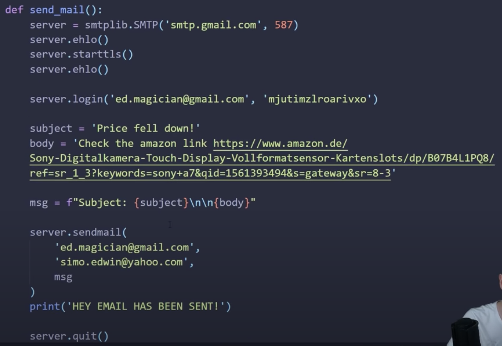

# Web Scraping

[Home](../README.md)    
[Reference](https://www.youtube.com/watch?v=Bg9r_yLk7VY) 
[Reference](https://towardsdatascience.com/how-to-web-scrape-with-python-in-4-minutes-bc49186a8460)


```
In terminal:
pip install requests bs4

in py file:
import requests
URL = 'amazon website as example'
```

  
 
 
