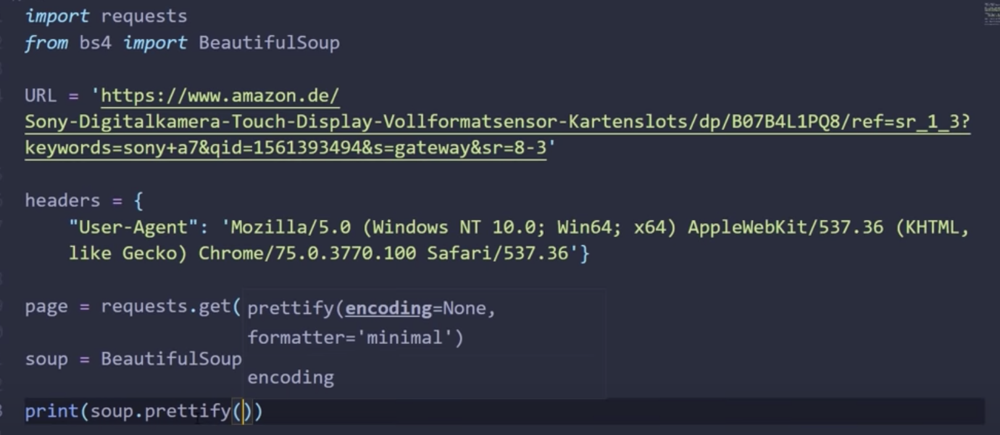
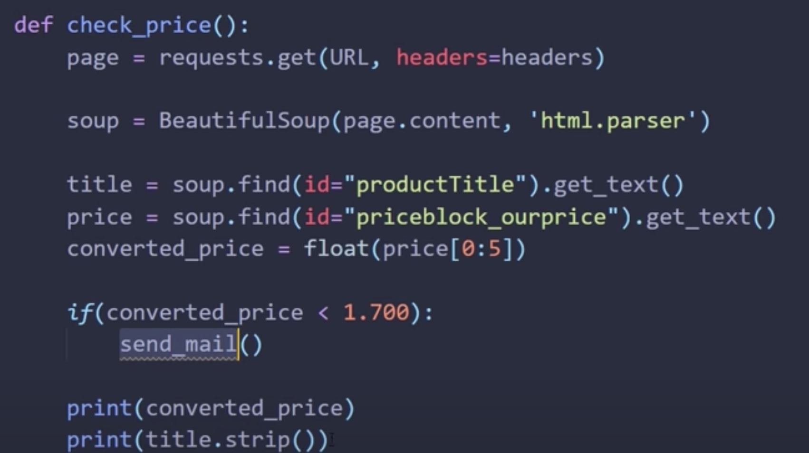

# Web Scraping

[Home](../README.md)      
[Youtube](https://www.youtube.com/watch?v=Bg9r_yLk7VY)   
[Python in 4 min](https://towardsdatascience.com/how-to-web-scrape-with-python-in-4-minutes-bc49186a8460)  
[Beautiful Soup](https://www.crummy.com/software/BeautifulSoup/)  

__Definition__:
Web scraping, web harvesting, or web data extraction is data scraping used for extracting data from websites. Web scraping software may access the World Wide Web directly using the Hypertext Transfer Protocol, or through a web browser. While web scraping can be done manually by a software user, the term typically refers to automated processes implemented using a bot or web crawler. It is a form of copying, in which specific data is gathered and copied from the web, typically into a central local database or spreadsheet, for later retrieval or analysis.

```
In terminal:
pip install requests bs4

in py file:
import requests
URL = 'amazon website as example'
```

  
 
 
