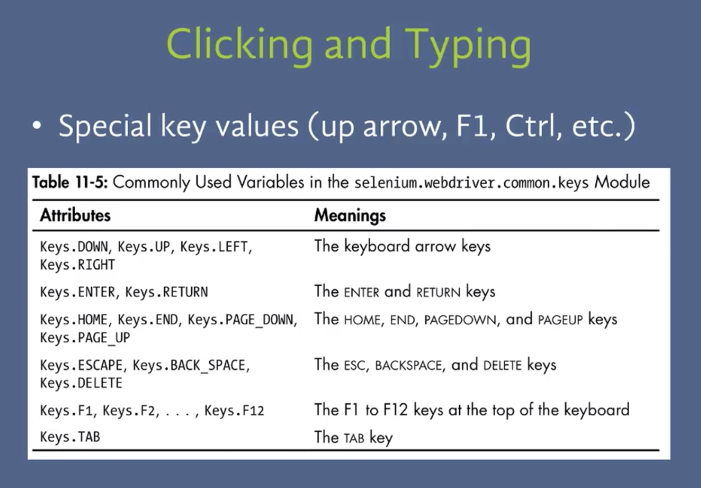

# Automation

[Home](../README.md)      
[Youtube](https://www.youtube.com/watch?v=jhXCTbFnK8o)  
[Automate the boring stuff](https://automatetheboringstuff.com/)  

## Selenium  
* This allows us to control a browser and create a browser bot  

[YouTube](https://www.youtube.com/watch?v=dZLyfbSQPXI)  
[Key Cheat sheet](https://www.selenium.dev/selenium/docs/api/py/webdriver/selenium.webdriver.common.keys.html)
  
  
  

## Watchdog  
[Reference](https://pythonhosted.org/watchdog/)  
* Python API library and shell utilities to monitor file system events.  
* Directory monitoring made easy with
A cross-platform API.
A shell tool to run commands in response to directory changes.
Get started quickly with a simple example in __Quickstart__.  

## Shutil
[Reference](https://pymotw.com/3/shutil/)  

